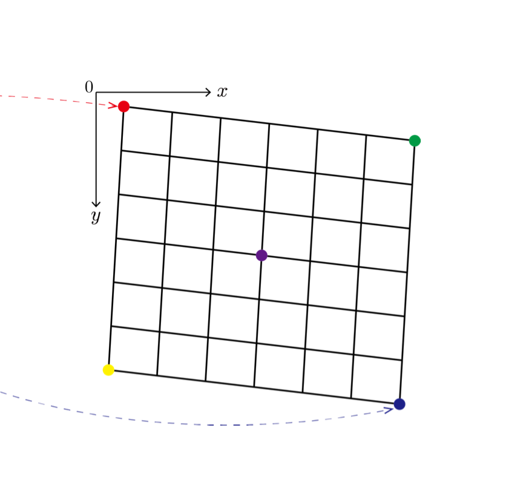

<p align="center">
  
</p>


# TERESA

## TERESA 是什么？

`[Te]rrain [Re]gistration and [Sa]mpling Software` 是一个用来针对 SAR（Synthetic Aperture Radar） 的 SLC（Single Look Complex） 数据的配准与重采样的服务（[什么是配准与重采样？](https://www.mdpi.com/2072-4292/10/9/1405/htm)）。

`teresa` 可以实现对影像栈（a **stack** of SAR SLC images）的批量配准。目前 `teresa` 配准的实现方式是一个基于 `gpt`（[什么是 gpt？](http://step.esa.int/docs/tutorials/command_line_inSAR_processing.pdf)） 的 wrapper。

## TERESA 有什么特色？

`teresa` 可以基于命令行进行批处理，通过一系列的优化，极大地提高运行效率。


## 安装

`teresa` 的安装步骤如下：

### 1. 下载

```bash
# 你可以把 $HOME 换成任何你想要存放 teresa 的文件夹。
git clone git@github.com:aprilab-dev/teresa.git $HOME/teresa
```

### 2. 安装依赖

我们推荐在安装时使用虚拟环境（[什么是虚拟环境？](https://realpython.com/python-virtual-environments-a-primer/)）。如果你熟悉虚拟环境的创建，可以使用任意你喜欢的虚拟环境创建方法。如果你没有什么所谓，我们推荐使用 python 自带的 `venv`。

首先，请确认你已经安装了 `python3 >= 3.6`，且 python 在你的系统路径中：

```bash
# 确认系统中的 python 已经安装
which python3
```

接下来我们创建虚拟环境：

```bash
python3 -m venv $HOME/.venv/teresa
source $HOME/.venv/teresa/bin/activate
```

最后我们在虚拟环境中安装依赖包：

```bash
pip install --upgrade pip wheel  # wheel is required for setup.py
pip install -e $HOME/teresa
```

现在你就可以使用 `teresa` 了。为了确认你已经安装 `teresa`，你可以在终端中输入：

```bash
teresa
```

如果出现以下提示信息，则表示 `teresa` 已经安装成功。

```bash
Usage: teresa [OPTIONS] COMMAND [ARGS]...

  Teresa is a command line tool for coregistering a stack of SAR SLC images.

Options:
  --version  Show the version and exit.
  --help     Show this message and exit.

Commands:
  coregister  Coregistrating a stack of SAR SLC images from source directory
```

## 示例

`teresa` 可以同时使用 python 命令调用，或者直接在终端中直接运行。

### CLI （Command Line Interfance, 推荐使用方式）

```bash
# 查看帮助
teresa coregister --help
# 运行命令
# /path/to/source/dir 里面存放着所有的 SLC 文件夹或 zip 文件
teresa coregister --dry-run --source-dir /path/to/source/dir --destination /path/to/destination --master yyyymmdd
# 或者，简短版
teresa coregister -n -s /path/to/source/dir -d /path/to/target/dir -m yyyymmdd
```

### Python

```python
# example.py
import stack

source_dir = "/data/slc/cn_xian_s1_asc_iw"
destination = "/data/stack/cn_xian_s1_asc_iw"
master = "20210401"

output = (
    stack
    .Sentinel1SlcStack(sourcedir=source_dir)
    .load()
    .coregister(output=destination, master=master, dry_run=False)
)
```

## 设置 `gpt` 的路径

因为 `teresa` 是一个关于 `gpt` 的 wrapper，所以我们需要设置 `gpt` 的路径。*部分*默认的 `gpt` 已经设置在了系统环境变量 `SNAP_GPT_EXECUTABLE` 中（通常是在 `/etc/profile.d/tq.sh` 中定义），你可以用以下方法查看：

```bash
>>> echo $SNAP_GPT_EXECUTABLE
/opt/snap/bin/gpt
```

如果你想要使用另一个版本的 `gpt`，或者你自己的服务器上没有设置 `SNAP_GPT_EXECUTABLE`， 你也可以在自己的 `.bashrc` 文件中设置 `SNAP_GPT_EXECUTABLE`，例如：

```bash
# .bashrc
>>> export SNAP_GPT_EXECUTABLE="/your/own/path/of/gpt"
```

然后运行 `source .bashrc` 命令激活该环境变量。
