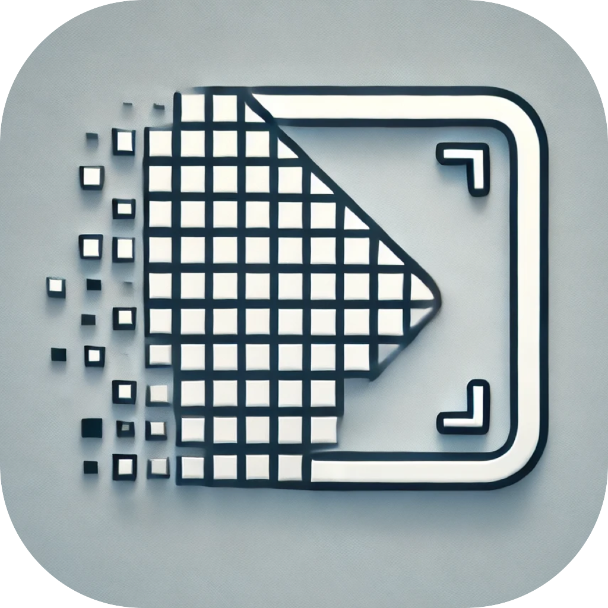

<p align="center">
  
</p>

# What is TERESA?
`TERESA (Terrain Registration and Sampling Software)` is a batch SAR image coregistration tool developed by the APRILAB (Automated Phase Reconstruction and Interferometry Lab), School of Electronics and Information, Northwestern Polytechnical University.  

It is built upon the European SAR processing software **DORIS**, with extensive customization and optimization tailored specifically for Chinese domestic SAR satellite data.  

The current version of TERESA successfully supports automated batch processing of image data from major domestic SAR satellites, including **Lutan-1** and the **Fucheng-1 series**. It significantly improves processing efficiency and stability while maintaining high-precision coregistration results. The tool supports automated workflows for large-scale interferogram generation, ground deformation monitoring, and related InSAR applications.  

Future versions will continue to expand compatibility with more domestic SAR platforms and further integrate intelligent coregistration algorithms and parallel acceleration frameworks, serving the autonomous and engineering-oriented processing of domestic remote sensing data.

------------------------------------------------------------

📦 Installation
---------

Clone the project and install dependencies (under a conda environment):

```bash
git clone https://github.com/aprilab-dev/teresa.git
conda env create -f environment.yml 
```

Install via `pyproject.toml`:

```bash
git clone https://github.com/aprilab-dev/teresa.git
cd teresa

# Recommended: use a virtual environment
conda env create -f environment.yml 
conda activate teresa

# Install using PEP 517 standard
pip install -e .
```

------------------------------------------------------------

🚀 Quick Start
---------

First, compile the DORIS executable, see:  
[https://github.com/aprilab-dev/doris.git](https://github.com/aprilab-dev/doris.git)

Configure the DORIS executable path in TERESA:  

- In the `dorisProcessor` class, set the local DORIS executable path in the `_DORIS` variable inside `self._doris`.

Run with a parameter configuration file:  

```bash
python main.py templates/doris.parms
```

Or, after installing with `pyproject.toml`, run directly from terminal:  

```bash
teresa --parms_path templates/doris.parms
```

------------------------------------------------------------

⚙️ Configuration File: `doris.params`
----------

See details in: `/templates/README.md`

------------------------------------------------------------

📁 Project Structure
----------

```
teresa/
├── templates/        Parameter files
├── teresa/           Coregistration logic
    ├── coregistion/  Coregistration routines
    ├── dump/         Data import modules for different satellites
    ├── processor/    Steps of the coregistration workflow
    ├── slcStack/     SLC-related data
    ├── utils/        Utility functions
    ├── cli.py        Command-line interface
├── setup.py          CLI setup
├── main.py           Main entry point
└── README.md         Project documentation
```

------------------------------------------------------------

🧪 Example Workspace Structure
----------

```
workspace/
├── yyyymmdd/     Contains original SLC data, meta file symlinks, 
│                coregistered results, and log files
├── dem/          DEM-related data and results
├── dorisin/      Required dorisin files
└── master/       Master image symlinks and related data
```

------------------------------------------------------------

👥 Development Team
----------

**APRILab**  
Automated Phase Reconstruction and Interferometry Lab  
School of Electronics and Information, Northwestern Polytechnical University  
Contact: yuxiao.qin@nwpu.edu.cn  
Homepage: [APRILab](https://github.com/aprilab-dev)

------------------------------------------------------------

📜 License
--------

This project is released under the **GNU License**. See the LICENSE file for details.

------------------------------------------------------------

🧭 Contribution Guide
---------

We welcome all forms of contributions, including issues, pull requests (PRs), and documentation improvements.  

------------------------------------------------------------
